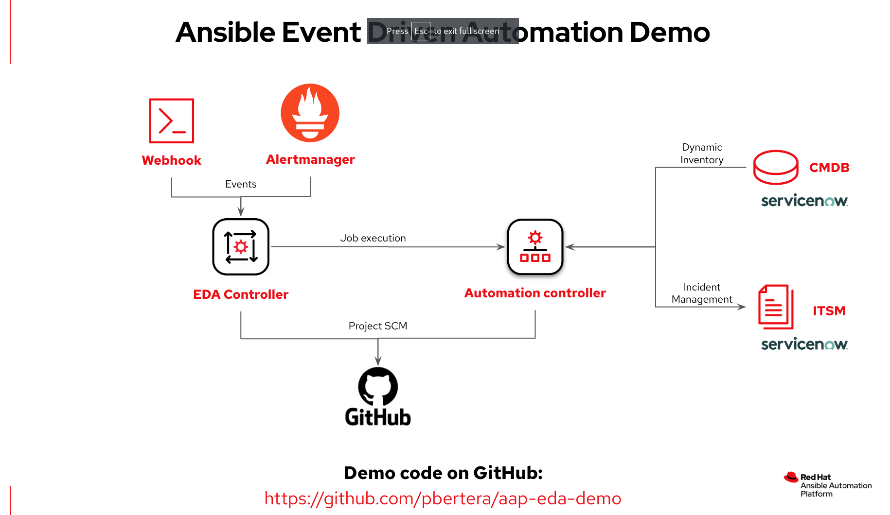

# Red Hat Ansible Automation Platform Demo



This repository contains the code to showcase a demo of Ansible Automation Platform on the following topics:

- Config as Code AAP management
- ServiceNow CMDB Dynamic inventory
- Event Driven Ansible and self Remediation
- ServiceNow ITSM integration

## Requirements

### AAP and EDA Controller

You can install a [Containerized Automation Platform and EDA controller](https://access.redhat.com/documentation/en-us/red_hat_ansible_automation_platform/2.4/html-single/containerized_ansible_automation_platform_installation_guide/index)

### Alertmanager

This demo contains a simple containerized Alertmanager that you can execute with `podman play kube`

```
$ cd utils/alermanager/
$ podman play kube alertmanager-pod.yaml --start
$ podman logs -f alertmanager-alertmanager
```

The alertmanager instance listens on the `9093` port.

### Service Now instance

You can easily sign-up for a developer instance on [https://developer.servicenow.com/](https://developer.servicenow.com/)

## Configuration

Before executing the demo you have to create a var file based on the [config-as-code/vars-empty.yml](config-as-code/vars-empty.yml) file.

### Token Configuration

In order to connect AAP and the EDA controller you have to:

1) Generate a Token in AAP ( `Access / Users -> admin -> token -> Add`) with **write** scope
2) Import the Token into the EDA Controller (`Access / Users -> admin -> token -> Create Controller Token`)

Alternatively you can configure the token with the provided playbook:

```
$ cd config-as-code
$ ansible-playbook create_token.yml -e @var.yml
```

### Configuration deployment

Once the token is configured you can deploy the configuration just executing the `aap_configuration.yml` playbook:

```
$ ansible-playbook aap_configuration.yml -e @var.yml
```

This playbook creates all the needed resources in AAP:
- Job template `Setup AAP EDA Demo` triggering the `aap_configuration.yml` playbook
- Job templates `Demo EDA Webhook handler` and `Demo EDA Alertmanager handler` to handle the EDA events
- `servicenow.itsm` new credential type
- Automation Hub, Controller and Service Now credentials
- Service Now execution environment for the Dynamic inventory
- An inventory with an inventory source integrating the Service Now CMDB

## Kudos

This demo is mainly inspired by the great [kubealex](https://github.com/kubealex) work on another [EDA demo](https://github.com/kubealex/event-driven-automation)
